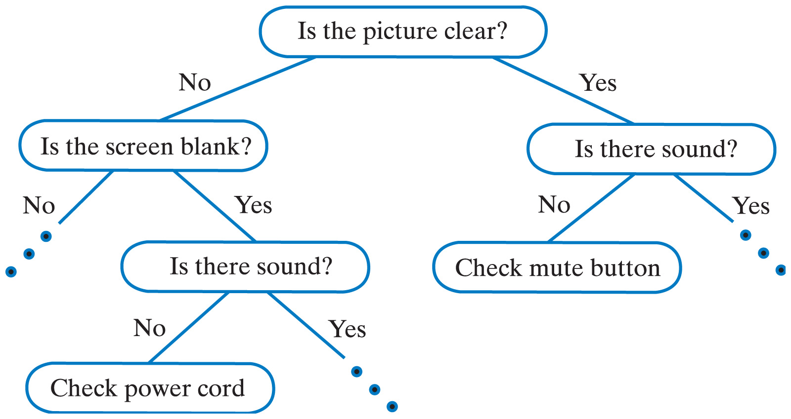
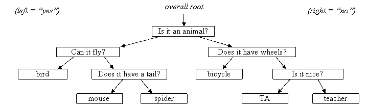

# Decision Tree
A decision tree is a tree in which each internal node contains a question that has a finite number of responses.  For example, we could use questions whose answers are true or false, yes or no, or multiple choice.  Each possible answer to that question corresponds to a child of that node.  Each child might be an addition question or a conclusion.  Nodes that are conclusions are leaf nodes. A yes/yo decision tree is a binary decision tree which each node has exactly two responses whose answers are yes or no. For example, the figure below shows part of a yes/no decision tree containing yes-no questions that diagnose a problem with a TV.  To use the tree, we first display the question at the root.  Depending on the user's answer, we then move to the appropriate child node and display the question in that node.  This way, we move from the root of the tree to a leaf according to the user's answers.  When we reach a leaf node, we provide a conclusion.



# Guessing Game
In that game, the user thinks about an object and the computer tries to guess it by asking yes/no questions to the user. The idea is that you construct a yes/no decision tree where each leaf has the name of an object and each branch node has a yes/no question that distinguishes between the objects. Each round of the game begins by you (the human player) thinking of an object.  The computer will try to guess your object by asking you a series of yes or no questions.  Eventually the computer will have asked enough questions that it thinks it knows what object you are thinking of.  It will make a guess about what your object is.  If this guess is correct, the computer wins; if not, you win. For example, in the tree below, the computer would begin the game by asking the player, "Is it an animal?"  If the player says "yes," the computer goes left to the "yes" sub-tree and then asks the user, "Can it fly?"  If the user had instead said "no" the computer would go right to the "no" subtree and then ask the user, "Does it have wheels?". This pattern continues until the game reaches a leaf  "answer" node.  Upon reaching an answer node, the computer asks whether that answer is the correct answer.  If so, the computer wins.



## Reading/Writing Decision Tree from/to a File
To be able to read and write a yes/no decision tree, we need a set of rules for how to represent the tree which we'll refer to as the standard format for a yes/no decision tree.  A tree is specified by a nonempty sequence of lines, two lines for each node of the tree.  The first of the two lines should  be either the text "Q" to indicate that it is a question node (i.e., a branch node) or the text "A" to indicate that it is an answer node (i.e., a leaf node).  The second line of the two lines should contain the text for that node (the question or answer).  The nodes should appear in pre-order (i.e., in the order produced by a pre-order traversal of the tree). For exemple, the linear form of the previous tree should be:
```
Q:Is it an animal?
Q:Can it fly?
A:bird
Q:Does it have a tail?
Q:Does it meow?
A:cat
A:mouse
A:spider
Q:Does it have wheels?
A:bicycle
Q:Is it nice?
A:TA
A:teacher
```
The functions read and write are inherently recursive and therefore must be wrote in a recursive way. To help you writing these functions, the pseudo-code for the read function is as follows:
```
read(input file)
  read one line which is either a "question" or  an  "answer"
  if the type of node is an "answer"
  then
    return a new "answer" node with the "answer" inside
  else
    read (recursively) the "yes" sub-tree
    read (recursively) the "no" sub-tree
    return a new "question" node with the "question" and the sub-trees inside
```

## Sample Run
```
$ java DecisionTree
Welcome to the Guessing Game
File name? animals.txt
Please think of an object for me to guess...
Can it fly n
Is it a very small animal n
Can you ride this animal n
Does it have stripes n
Does it have a curly tail n
Does it like to chew bones n
Does it hop n
Does it have horns n
Does it have wool on its back n
Does it have a very long neck n
Does the animal live in water y
Does your animal have a long nose n
Does it have a hard shell n
Does it have flippers y
Is it black and white y
Does it lay eggs y
Does it spout water n
Does it eat smaller animals, and live on the bottom of the sea n
Can it learn tricks to play at an aquarium y
Is it a type of bird y
Is it the biggest type of its speices n
Would your object happen to be penguin y
Great, I got it right!
```
